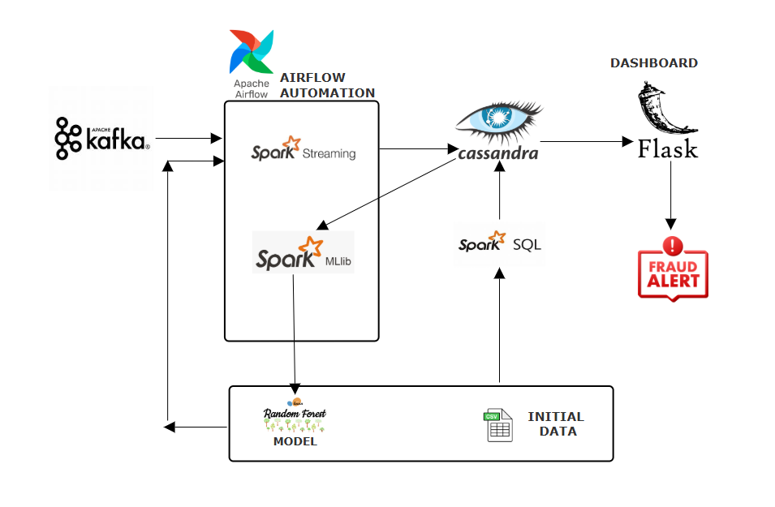

# Credit Card Fraud Detection — Big Data Pipeline

> End-to-end demo: batch ETL, distributed model training, and real-time scoring.



This repository demonstrates a realistic credit-card fraud detection pipeline built with big-data tools:

- Data ingestion and ETL with Apache Spark (PySpark)
- Storage in Apache Cassandra (with Parquet fallback for local development)
- Batch model training using Spark MLlib (Random Forest)
- Real-time scoring using Spark Structured Streaming + Kafka
- Simple web dashboard (Flask + Socket.IO) for live alerts and metrics

This README explains the architecture, how to run the project from scratch, troubleshooting tips, and where to find the detailed training report generated by the training step.

---

## Contents

- `src/` — main application code
  - `spark_data_import.py` — ETL: load CSVs, transform data, write to Cassandra (Parquet fallback)
  - `spark_ml_training.py` — feature engineering, Spark ML pipeline, training, metrics, and detailed report writer
  - `spark_streaming_detector.py` — Spark Structured Streaming job for real-time scoring (Kafka → ML → Cassandra)
  - `kafka_producer.py` — helper to produce synthetic transactions to Kafka topic
  - `dashboard.py` — Flask + Socket.IO dashboard and APIs
- `dataset/` (or `data/`) — CSV inputs used by ETL
- `reports/` — training reports written by `spark_ml_training.py`
- `models/` — serialized Spark model saved by the training job
- `architecture.png` — system architecture diagram (referenced above)
- `run.sh` — helper script to run pipeline/stream/producer/dashboard commands
- `requirements.txt` — Python dependencies for local scripts
- `docker-compose.yml` — Docker Compose definitions (Cassandra, Kafka, Zookeeper, optional Spark services)

---

## How this maps to a typical academic project

- Input: credit-card transactions (CSV) → ETL transforms include parsing timestamps, computing distances, extracting merchant/category, and deriving `age`, `trans_hour`, `distance` features.
- Stored copies: written to Cassandra for online use and also saved to Parquet for reproducible training runs.
- Model training: Spark ML pipeline uses categorical indexing, vector assembly, scaling, and a Random Forest classifier. The training script writes a detailed text report to `reports/` containing:
  - Spark version and configuration snapshot
  - Dataset counts and class distribution
  - Features used (numeric and categorical)
  - Training/test split sizes
  - Hyperparameters
  - Performance metrics (Accuracy, Precision, Recall, F1, AUC)
  - Confusion matrix and top feature importances
  - A sample of predictions

This report is intended for submission or inclusion in a project write-up.

---

## Quick Start — Fresh machine

Prerequisites

- Docker & Docker Compose (recommended) OR a running Kafka + Cassandra cluster
- Python 3.10 (virtual environment recommended)
- Java (if you run Spark locally outside containers)

1) Clone the repo

```bash
git clone <repo-url>
cd creditcard_fraud_detection
```

2) Bring up infrastructure (recommended: Docker Compose). This project includes a `docker-compose.yml` that defines Cassandra, Kafka, and Zookeeper.

```bash
# Use `docker compose` (newer) or `docker-compose` depending on your system
docker compose up -d
# or
# docker-compose up -d
```

3) Create & activate Python virtualenv and install Python deps

```bash
python3 -m venv venv
source venv/bin/activate
pip install -r requirements.txt
```

4) Import data (ETL) — this writes data into Cassandra and saves Parquet fallback

```bash
# Run the Spark ETL script (this script uses local Spark via pyspark)
python src/spark_data_import.py
# or use the convenience runner if present
# ./run.sh import
```

5) Train the model and generate the detailed training report

```bash
python src/spark_ml_training.py
# A report will be written to the `reports/` folder, e.g.:
ls -lah reports/
cat reports/spark_fraud_training_report_YYYY-MM-DD_HH-MM-SS.txt | sed -n '1,200p'
```

6) Start the streaming detector (in a new terminal)

```bash
# Ensure the Kafka topic exists (the streaming code tries to create it automatically if kafka-python is available)
python src/spark_streaming_detector.py
# or
# ./run.sh stream
```

7) Start a producer to send transactions (in a separate terminal)

```bash
python src/kafka_producer.py
# or
# ./run.sh producer
```

8) Start the dashboard (in another terminal)

```bash
python src/dashboard.py
# or
# ./run.sh dashboard
# Then open http://localhost:8080
```

9) Stop everything when finished

```bash
# Stop local services
docker compose down
# or
# docker-compose down
```

---

## Troubleshooting notes (common issues & fixes)

1. Spark tries to contact HDFS (localhost:9000) when given relative paths
   - Fix: the code forces local filesystem by setting `spark.hadoop.fs.defaultFS` to `file:///` and using absolute `file://` paths when reading CSVs. If you still see HDFS errors, ensure you re-run scripts after activating the virtualenv where pyspark is installed.

2. Cassandra timeouts on `COUNT(*)` queries
   - Cassandra is not built for fast full-table aggregation. The dashboard originally used `COUNT(*)` which can time out on dev clusters. The dashboard now caches stats and uses timeouts to avoid repeated heavy queries.
   - Recommended: create a small `dashboard.stats` table and maintain counters during ETL/streaming for cheap reads. Consider adding a short job in your ETL to write precomputed counts to Cassandra.

3. Kafka topic not found / UnknownTopicOrPartitionException
   - Ensure your Kafka container is healthy and the topic `creditcardTransaction` exists. The streaming script includes a best-effort helper to create the topic using `kafka-python`'s `KafkaAdminClient`.
   - You can also create the topic manually inside the Kafka container:

```bash
# (example using docker container name `fraud-kafka`)
docker exec -it fraud-kafka kafka-topics --bootstrap-server localhost:9092 --list
docker exec -it fraud-kafka kafka-topics --bootstrap-server localhost:9092 --create --topic creditcardTransaction --partitions 1 --replication-factor 1
```

4. Model training / pyspark errors
   - Ensure `pyspark` is installed in the same Python environment used to run the scripts (`pip install -r requirements.txt`). If your system Spark version and pyspark Scala versions mismatch, include the correct Cassandra/Spark connector via `spark.jars.packages` in the SparkSession builder.

---

## Where the detailed training report is

The training script writes a text report to `reports/` named like:

```
reports/spark_fraud_training_report_2025-12-08_14-40-51.txt
```

The report includes:
- Timestamp & Spark version
- Spark configuration snapshot
- Dataset summary and sampling ratio
- Feature lists used by the model
- Training/test split sizes
- Performance metrics and confusion matrix
- Top feature importances
- A CSV sample of predictions for quick inspection


---


